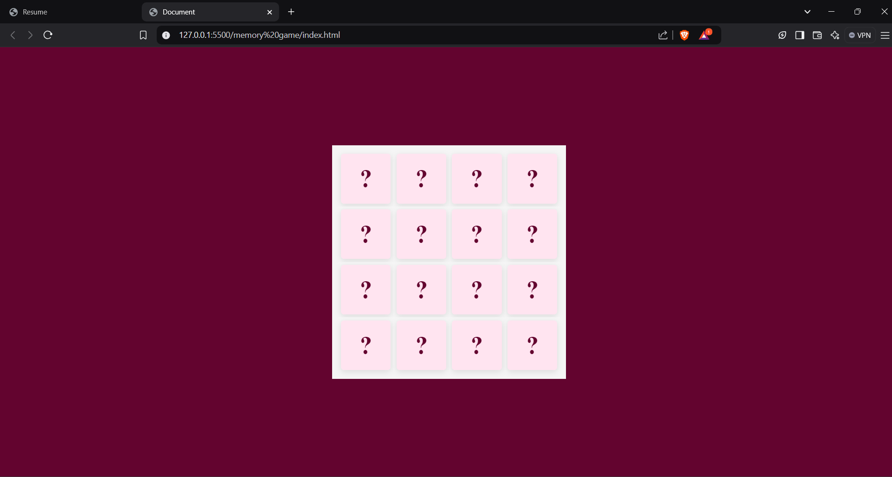
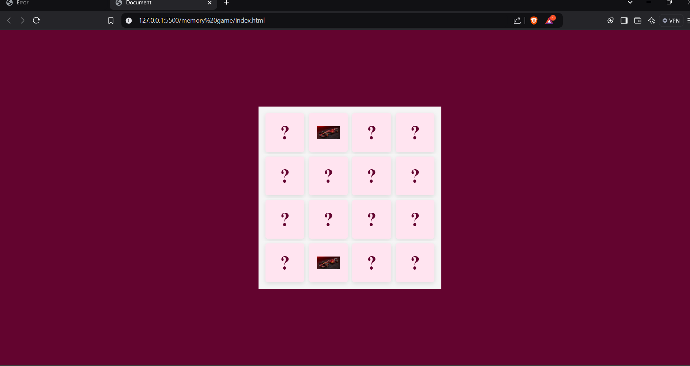

<h1>
  Memory-Game
</h1>
<h3>
  Summary 
</h3>

  The memory game is an interactive project created with HTML, CSS, and JavaScript that tests players' memory and concentration skills. The game consists of a grid of cards displayed face down, with each card having a matching pair. Players click on cards to flip them and try to match pairs by remembering their positions.

If a match is found, the cards remain face-up; otherwise, they flip back, and the player continues. The game incorporates a timer to track the duration of gameplay and a moves counter to measure efficiency, encouraging players to improve their performance over time.

Visually, the game is designed with a user-friendly interface, including vibrant card designs, smooth flipping animations, and responsive elements for various screen sizes. CSS handles the layout and animations, while JavaScript adds functionality for game logic, including shuffling cards using algorithms like Fisher-Yates and managing game states.

This project is a perfect blend of creativity and coding, showcasing essential web development skills like DOM manipulation, event handling, and responsive design. It’s engaging, educational, and an excellent addition to a beginner or intermediate developer’s portfolio.

<h4>
  The output of the Game before playing is:-
</h4>

<h4>
  The output while playing the game is :-
</h4>

<h4>
  The output after playing the game is:-
</h4>

